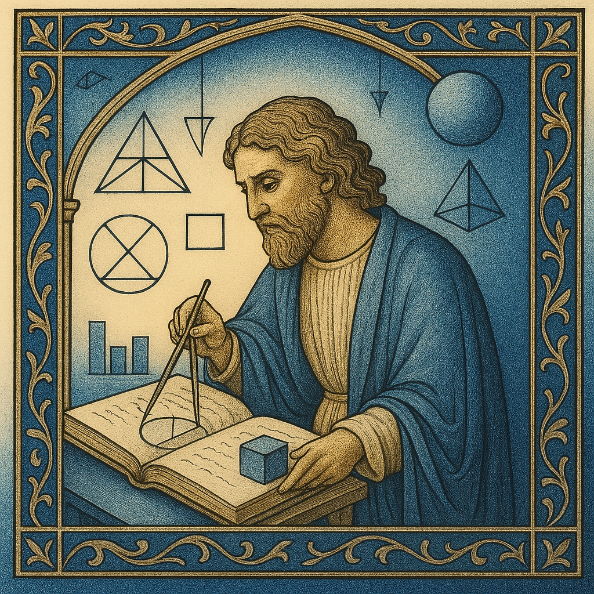
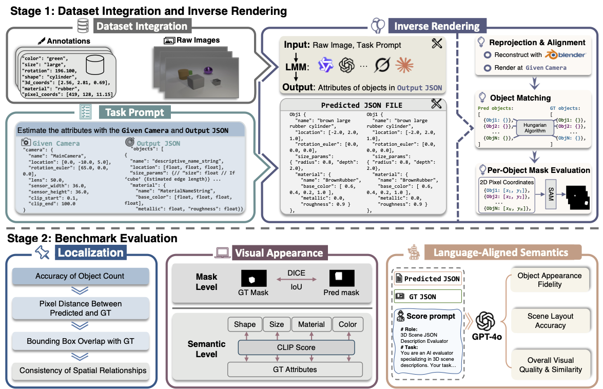

<h1 style="border: none; margin-bottom: 0;">
  IR3D-Bench: Evaluating Vision-Language Model Scene Understanding as Agentic Inverse Rendering
</h1>

*"What I cannot create, I do not understand."* *——Richard Feynman*

<p align="center">
  <a href="https://arxiv.org/abs/2506.23329"></a>
  <a href="https://ir3d-bench.github.io/"></a>
  <a href="https://youtu.be/GRQ9ZjyP5tY"></a>
</p>

<p align="center">
  
</p>

> [**IR3D-Bench: Evaluating Vision-Language Model Scene Understanding as Agentic Inverse Rendering**]()<br>
> [Parker Liu]()<sup>1,\*</sup>, [Chenxin Li](https://chenxinli001.github.io/)<sup>1,\*</sup>,
[Zhengxin Li](https://github.com/Lizx123456)<sup>2</sup>,
[Yipeng Wu](https://github.com/wind-bell999)<sup>2</sup>,
[Wuyang Li](https://wymancv.github.io/wuyang.github.io/)<sup>3</sup>,
[Zhiqin Yang](https://visitworld123.github.io/)<sup>1</sup>,
[Zhenyuan Zhang](https://openreview.net/profile?id=~Zhenyuan_Zhang2)<sup>4</sup>,
[Yunlong Lin](https://lyl1015.github.io/)<sup>5</sup>,
[Sirui Han](https://facultyprofiles.hkust.edu.hk/profiles.php?profile=sirui-han-siruihan)<sup>4</sup>,
[Brandon Y. Feng](https://brandonyfeng.github.io/)<sup>6</sup>,
<br> <sup>1</sup>CUHK, <sup>2</sup>TJU, <sup>3</sup>EPFL, <sup>4</sup>HKUST, <sup>5</sup>XMU, <sup>6</sup>MIT


# 🌟 Motivation & Useful Findings
1. Inspired by Richard Feynman's aphorism, we propose a new perspective to evaluate the spatial visual understanding of VLMs through a pretext task: how effectively they can "recreate this scene."
2. It is found that the goal of scene reconstruction enables VLMs to spontaneously estimate key attributes (such as object ID, localization, color, material, and object relations) in an inverse rendering manner—attributes that are essential for understanding what they perceive.
3. It reveals surprising potential for mechanisms resembling human reflection: when we input the scenes recreated by VLMs back to them, they demonstrate a thinking process of comparing these recreated scenes with the original images and updating their understanding of the scene (i.e., the predicted key attributes). We anticipate that this multi-round feedback iteration mode will unlock more future possibilities in both understanding and generation.

# 🎨 Pipeline Overview
<p align="center">
  
</p>


# 🛠️ Environment setup
(1) Create Environment:
```shell
conda create --name ir3d python=3.10
conda activate ir3d
```

(2) First install [vllm](https://github.com/vllm-project/vllm)
```
pip install vllm
```

(3) Install Blender [on linux](https://docs.blender.org/manual/en/latest/getting_started/installing/linux.html)
```shell
snap install blender --classic
```
(4) Install [SAM](https://github.com/facebookresearch/segment-anything)
```shell
pip install git+https://github.com/facebookresearch/segment-anything.git
```

# 📚 Dataset setup
Download our processed data: [IR3D-bench-data](https://huggingface.co/datasets/Piang/IR3D-bench).

## Inverse Rendering
### Task prompt
Prompt for inverse rendering and gpt4o score is in `prompts/gpt4o_as_evaluator.txt` and `prompts/vlm_estimate_params.txt`
### Latest Proprietary Models
Modified the `model-name` as defined in `main_vllm.py` to use the required model.
```shell
python main_vllm.py --model-type "model-name"
```
### Open-source Models
Modified the `model-name` as you needed, such as "gpt-4o", "grok-3", etc.
```shell
python main_api.py \ 
    --image_dir /path/to/images \ 
    --result_dir /output/path \ 
    --prompt_path prompts/vlm_estimate_params.txt \ 
    --model_name "model-name"
```
## Eval
```shell
bash cal_metric.sh "/output/path" "/path/to/images" "GPI_ID"
```


# 🎈 Acknowledgement
Thanks to the following fantastic repos: [SAM](https://github.com/facebookresearch/segment-anything), [vllm](https://github.com/vllm-project/vllm), [Clever dataset](https://github.com/facebookresearch/clevr-dataset-gen), [Blender](https://www.blender.org/).

# 📒 Citation
If you find our work helpful, please consider citing:
```bibtex
@article{liu2025ir3d,
  title={IR3D-Bench: Evaluating Vision-Language Model Scene Understanding as Agentic Inverse Rendering},
  author={Liu, Parker and Li, Chenxin and Li, Zhengxin and Wu, Yipeng, and Li, Wuyang and Yang, Zhiqin and Zhang, Zhenyuan and Lin, Yunlong and Han, Sirui and Feng, Brandon},
  journal={arXiv preprint},
  year={2025}
}
```
